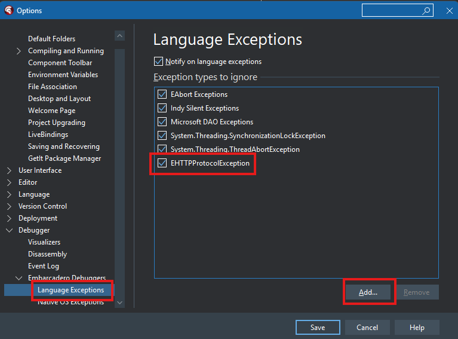

# Troubleshooting

## About this file

This file contains solutions to the main compilation and deployment problems you may encounter while working with this project.

## Delphi Build Errors

### SQLite Database Errors

If you encounter any connection problems with SQLiteDatabase, check if the file `desktop/Win32/Debug/database.match` was created. If it was not, copy the file `desktop/dll/sqlite3.dll` to `desktop/Win32/Debug/dll/sqlite3.dll`.

### EHTTPProtocolException

An error may occur when trying to run the application in Delphi: `EHTTPProtocolException` that terminates the application. To avoid this error, the exception must be added in **Tools / Options**. Within this window, access **Debugger / Embarcadero Debuggers / Language Exceptions** and add `EHTTPProtocolException` as shown in the image below.

